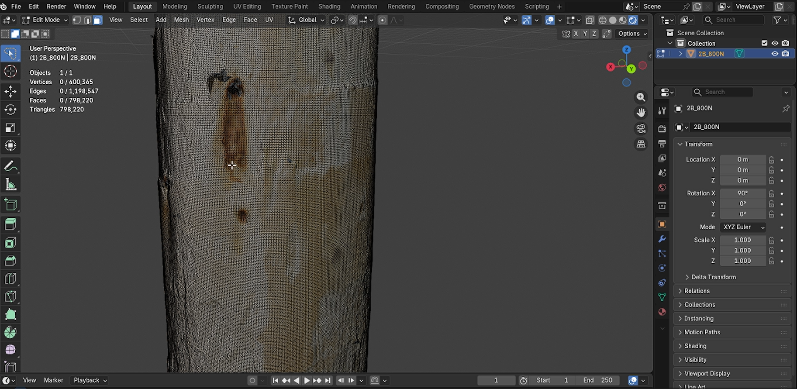
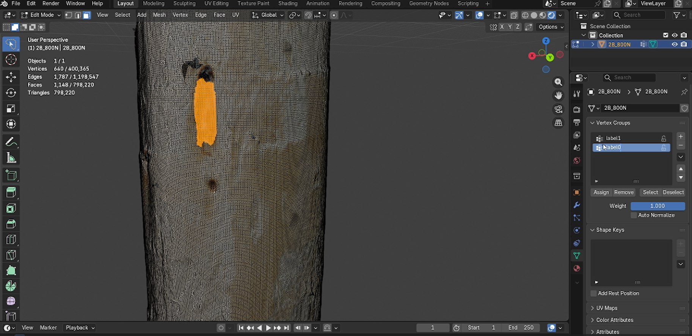
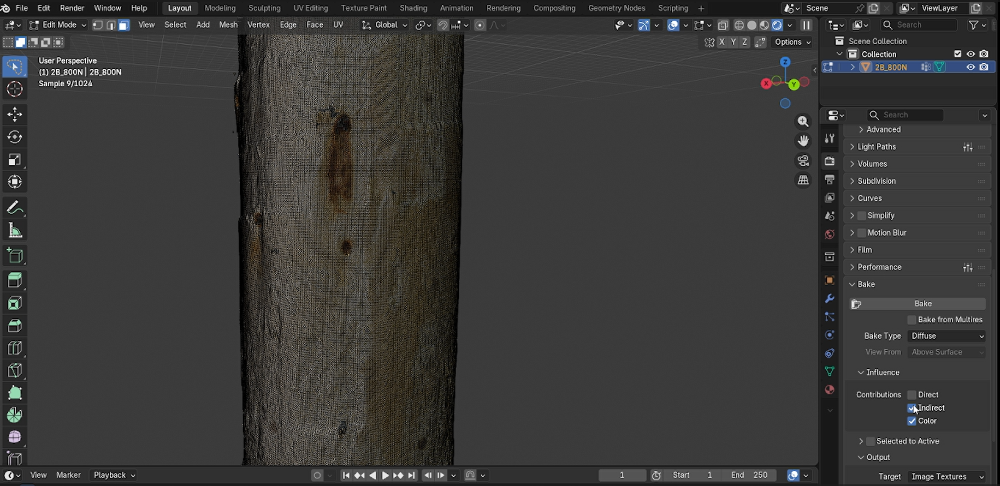
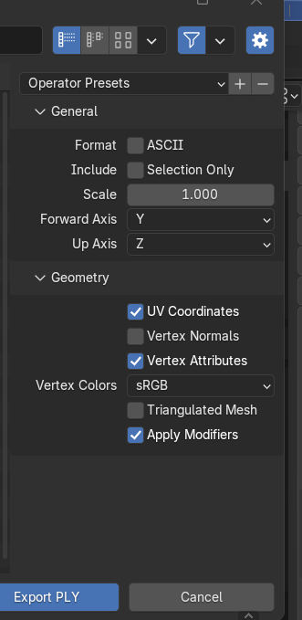

# 3D Log Bark Segmentation

PointNet++ semantic segmentation of residual bark on debarked logs.

Classifies each point of a log surface as **wood** or **bark** and estimates the bark area from 3D point clouds exported from Blender.

---

## Results

Best model after 100 epochs (May 2026, 41 labeled logs):

| Metric | Value |
|---|---|
| Best mIoU | **0.758** (epoch 67) |
| Bark IoU | **0.543** |
| Accuracy | **0.973** |
| Training time | ~77 min (CPU) |

---

## Business Impact

Log debarking is one of the first steps in wood manufacturing. In Canadian sawmills, ring debarkers remove bark before logs are chipped or sawn — but debarking is never perfect, and residual bark is a measurable industrial problem.

### The problem, by the numbers

Research on black spruce logs under real industrial conditions (Cáceres, Hernández, Rosero-Alvarado et al., *Wood and Fiber Science*, 2022) quantified the extent of the problem:

- Bark Remaining on Log (BRL) ranged from **1% to 24%** depending on tool geometry and temperature.
- Under frozen conditions (−20°C), BRL reached **24%** — more than 5× the optimal level.
- Eastern Canadian pulp mills accept a maximum of **1% bark content** in wood chips.
- Excess bark reduces pulp brightness, strength, and yield, directly lowering chip commercial value.
- BRL also prevents accurate log scanning, which is critical for maximizing lumber recovery.
- In Quebec, **71% of wood raw material** for pulp and paper arrives as chips from sawmills (MFFP 2018).

### The measurement gap

That study measured BRL from 2D projections of 3D scanner images. This approach works well for controlled experimental measurements but relies on flat projections — bark hidden in surface concavities, grooves, and knot zones is not visible, leading to systematic underestimation in the most problematic regions.

### What this project adds

This project extends bark measurement to full 3D point cloud analysis. Every surface point is classified directly from geometry — no projection required:

- Bark in concave regions and knot zones is detected where 2D projections fail.
- Output is a **quantitative per-log bark area estimate**, not just a pass/fail signal.
- Runs on **CPU**, making it deployable without specialized hardware on the mill floor.
- Useful for sawmills optimizing debarker settings, pulp mills validating chip quality, and researchers studying debarking efficiency.

> Cáceres C.B., Hernández R.E., Rosero-Alvarado J., Nurbaity R.A. (2022). *Effect of tool tip radius on ring debarker performance of frozen and unfrozen black spruce logs.* Wood and Fiber Science, 54(3), 161–172. https://doi.org/10.22382/wfs-2022-16

---

## How It Works

1. Export log scans from Blender as `.ply` with material labels (`madera` / `corteza`).
2. Place files in `data/raw/`.
3. Train PointNet++ to classify each point as wood (0) or bark (1).
4. Run inference on new logs to get a color-coded segmented cloud and bark area estimate.

---

## Requirements

- Python 3.10+
- CPU only (no GPU required)
- Docker + VS Code Dev Containers (recommended)

Key dependencies: `torch==2.2.2`, `open3d==0.18.0`, `numpy==1.26.4`

---

## Installation

### Option A: Dev Container (recommended)

1. Open the repository in VS Code.
2. Run **Dev Containers: Reopen in Container**.
3. Use the integrated terminal inside the container.

### Option B: Local virtual environment

**Linux / macOS:**
```bash
python -m venv .venv
source .venv/bin/activate
pip install -r requirements.txt
pip install -e .
```

**Windows:**
```bash
python -m venv .venv
.venv\Scripts\activate
pip install -r requirements.txt
pip install -e .
```

If `python -m venv` fails in WSL/Debian due to missing `ensurepip`:

```bash
python3 -m pip install --user --break-system-packages virtualenv
python3 -m virtualenv .venv
source .venv/bin/activate
pip install -r requirements.txt
pip install -e .
```

---

## Quick Start

```bash
git clone https://github.com/jediros/3D-Logs-Segmentation.git
cd 3D-Logs-Segmentation
```

```bash
# 1. Check your dataset
python main.py info

# 2. Train
python main.py train

# 3. Segment a new log
python main.py infer --input data/raw/new_log.ply --visualize
```

---

## Command Reference

| Command | Description |
|---|---|
| `python main.py info` | Analyze PLY files and show label statistics |
| `python main.py train` | Train the model |
| `python main.py train --resume` | Resume training from last checkpoint |
| `python main.py infer --input <file.ply>` | Segment a log |
| `python main.py infer --input <file.ply> --visualize` | Segment and open 3D viewer |
| `python main.py visualize --file <file.ply>` | Visualize a point cloud with labels |
| `python main.py preprocess` | Pre-process PLY → .npy cache (optional) |
| `python main.py preprocess --overwrite` | Rebuild all cached files |

Global options must come before the subcommand:

```bash
python main.py --config config/smoke.yaml train
```

---

## 3D Tagging and Data Preparation in Blender

This section outlines the procedure for segmenting 3D log scans and exporting them into a `.ply` format containing spatial coordinates, color data, and semantic labels (`X Y Z R G B Label`).

### Phase 1: Scene Preparation



1. **Initialize Environment:**
   - Open Blender and create a new **General** file.
   - Press `A` to select all default objects and `Delete` to clear the scene.
2. **Import 3D Scan:**
   - Go to **File > Import > Wavefront (.obj)** and select your log scan file.
   - Go to **View > Frame All** (or press `Numpad .`) to center the scan in your viewport.
3. **Viewport Setup:**
   - Switch to **Viewport Shading: Rendered** (top right icon).
   - Open the Shading dropdown and uncheck **Scene Lights** and **Scene World** to see the raw texture without external lighting interference.
4. **Selection Mode:**
   - Tab into **Edit Mode**.
   - Set the selection tool to **Lasso Select** (hold the selection icon in the left toolbar).
   - Set the selection mode to **Face Select** (top left or press `3`).

### Phase 2: Semantic Tagging (Labeling)



1. **Select Bark Area:** Use the Lasso tool to select the surface area representing **Bark**.
2. **Assign Vertex Groups:**
   - Go to the **Object Data Properties** tab (green triangle icon).
   - In the **Vertex Groups** panel, click `+` twice to create two groups.
   - Rename the first group to `label1` (Bark) and the second to `label0` (Wood).
   - With the bark faces selected, select `label1` and click **Assign**.
3. **Select Wood Area:**
   - Invert the selection: **Select > Invert** (or `Ctrl + I`).
   - Select `label0` in the Vertex Groups panel and click **Assign**.
4. **Finalize Geometry:**
   - Tab back to **Object Mode**.
   - Press `Ctrl + A` and select **All Transforms** to reset scale and rotation.
   - Right-click the object and select **Set Origin > Origin to Geometry**.

### Phase 3: Converting Texture to Vertex Color (Baking)



Blender handles textures externally. To export color within the `.ply` file, the texture must be baked into the vertices.

**1. Create Color Attribute**
- Go to **Object Data Properties** (green triangle).
- Expand **Color Attributes** and click `+`.
- **Name:** `ColorScan` | **Domain:** `Corner` | **Data Type:** `Byte Color`

**2. Bake Procedure**
- Go to **Render Properties** (camera icon).
- Change the **Render Engine** from Eevee to **Cycles**.
- Scroll to the **Bake** section and configure:
  - **Bake Type:** `Diffuse`
  - **Influence:** Uncheck **Direct** and **Indirect** — leave only **Color** checked.
  - **Output > Target:** `Color Attribute`
- Click **Bake** and wait for the progress bar to complete.

### Phase 4: Exporting the Dataset



1. Go to **File > Export > Stanford (.ply)**.
2. In the export settings panel, configure:
   - **Format:** `Binary` (or `ASCII` to inspect in a text editor).
   - **Geometry:** Check **UV Coordinates**, **Vertex Attributes**, and **Vertex Colors**.
   - **Color Mode:** `sRGB`
   - Check **Apply Modifiers**.
3. Click **Export PLY**.

The resulting file contains the consolidated data structure: **X Y Z** (coordinates), **R G B** (color), and **Label** (semantic ID).

> The loader expects label fields named `label_1` or `corteza`. Label conversion uses threshold 0.5.

---

## Preprocessing Cache

For large datasets, pre-process once to `.npy` for faster training:

```bash
python main.py preprocess
```

Then enable caching in `config/default.yaml`:

```yaml
preprocessing:
  use_cache: true
```

Run `preprocess` again if you add new `.ply` files. Use `--overwrite` to rebuild all cached files.

---

## Architecture

PointNet++ encoder-decoder for binary segmentation.

- **Input:** `(B, N, C)` — C = 9 (xyz + normals + rgb)
- **Encoder:** 3× SetAbstraction blocks
- **Decoder:** 3× FeaturePropagation blocks + MLP head + dropout
- **Output:** `(B, N, 2)` logits

Training: focal loss (γ=2), class weighting, Adam optimizer, StepLR decay, gradient clipping.

---

## Beyond Logs — Generalizing to Other 3D Solids

PointNet++ operates directly on raw 3D point clouds with no assumptions about object shape, size, or orientation. It learns local geometric patterns from neighborhoods of points — making it applicable to any solid that can be captured by a 3D scanner.

This pipeline is not limited to logs. The same architecture can be adapted to segment surface features on:

- **Other wood products** — branches, beams, or boards with different geometries
- **Industrial parts** — surface defect detection on manufactured components
- **Geological samples** — mineral classification on drill core scans
- **Any binary or multi-class segmentation task** on 3D point clouds

Adapting the pipeline to a new domain requires only new labeled data and updating the class definitions in `config/default.yaml`. The model architecture, training loop, and inference pipeline remain unchanged.

---

## Configuration

Main config: `config/default.yaml`

| Parameter | Value |
|---|---|
| `preprocessing.num_points` | 16384 |
| `model.use_normals` | true |
| `model.use_rgb` | true |
| `training.epochs` | 100 |
| `training.batch_size` | 4 |
| `training.learning_rate` | 0.001 |
| `training.val_split` | 0.2 |
| `training.class_weights` | [1.0, 10.0] |

---

## Outputs

After inference:

- `outputs/<log_name>_segmented.ply` — color-coded point cloud (green=wood, red=bark)
- Console summary with bark points, wood points, and bark ratio

Analysis scripts for visual comparison are in `extras/`.

---

## Metrics Tracked

- Per-class IoU (wood, bark)
- Mean IoU
- Precision, Recall, F1
- Accuracy

Training logs: `training/logs/train_log.csv`

---

## Project Layout

```
main.py
config/         # YAML configs
data/           # Raw and processed point clouds (not committed)
preprocessing/  # Sampling and normalization
model/          # PointNet++ architecture
training/       # Trainer, checkpoints, logs
inference/      # Predictor for new logs
utils/          # Metrics, logger, visualizer
tests/          # Unit tests
extras/         # Analysis and comparison scripts
.devcontainer/  # Docker environment
```

---

## Testing

```bash
pytest tests/ -v
```

---

## Contributors

This project was built through equal collaboration between both authors.

| Name | Contribution |
|---|---|
| [Jedi Rosero-Alvarado](https://github.com/jediros)
| [Bruna Ugulino](https://github.com/BrunaUgulino)

---

## License

MIT License.
