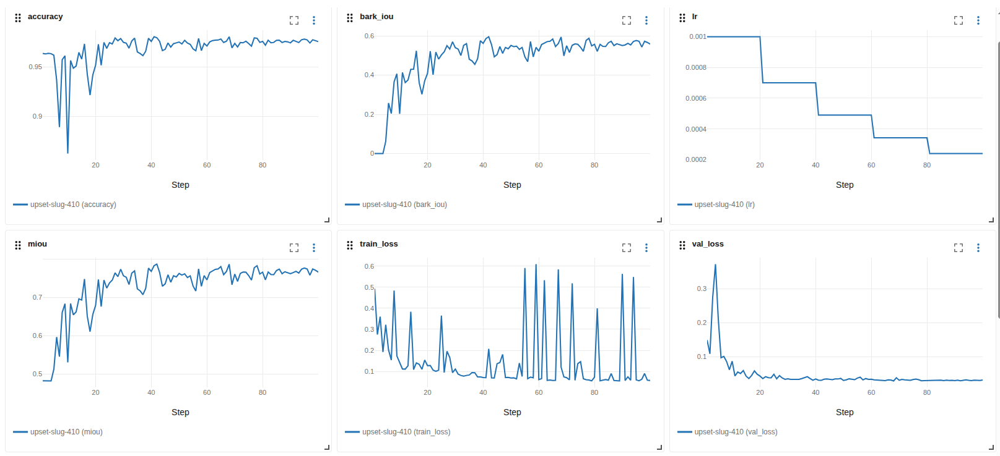

# 3D Log Bark Segmentation

A tool that looks at a 3D scan of a tree log and automatically marks, point by point, which parts of the surface are still covered in **bark** and which parts are clean **wood**. It also tells you what percentage of the log's surface is bark.

Think of it like a very detailed "coloring" tool: you feed it a 3D scan of a log, and it hands back the same scan with every point painted green (wood) or red (bark), plus a number like "12.4% of this log's surface is bark."

> **New here and not a programmer?** Read this whole document top to bottom — every technical term is explained the first time it shows up, inside boxes like this one. Sections marked **🔧 Technical** are for people who want to tweak the AI model itself; you can skip them and still use the project.

---

## Table of Contents

1. [Why this project exists](#why-this-project-exists)
2. [What you get out of it](#results)
3. [Glossary — words you'll see everywhere](#glossary)
4. [Before you begin (installing the tools)](#before-you-begin-installing-the-tools)
5. [The full workflow, in plain words](#the-full-workflow-in-plain-words)
6. [Step-by-step: from a raw scan to a trained model](#step-by-step-from-a-raw-scan-to-a-trained-model)
7. [Command reference](#command-reference)
8. [Labeling your scans in Blender](#labeling-your-scans-in-blender)
9. [Configuration reference 🔧](#configuration-reference)
10. [Model architecture 🔧](#model-architecture)
11. [Experiment tracking with MLflow](#experiment-tracking-with-mlflow)
12. [Troubleshooting / FAQ](#troubleshooting--faq)
13. [Project layout 🔧](#project-layout)
14. [Contributors & License](#contributors--license)

---

## Why this project exists

Log debarking is one of the first steps in wood manufacturing. In Canadian sawmills, ring debarkers strip bark off logs before they're chipped or sawn — but debarking machines are never perfect, and leftover ("residual") bark is a real, measurable problem.

**The problem, by the numbers** (from Cáceres, Hernández, Rosero-Alvarado et al., *Wood and Fiber Science*, 2022, on black spruce logs):

- Bark left on a log ranged from **1% to 24%**, depending on the debarking tool and the temperature.
- In frozen conditions (−20°C), it reached **24%** — more than 5× the acceptable level.
- Pulp mills in Eastern Canada accept a **maximum of 1% bark** in wood chips.
- Too much bark lowers the pulp's brightness, strength, and yield — it directly costs money.
- In Quebec, **71% of the wood used for pulp and paper** arrives as chips from sawmills.

**The gap:** that 2022 study measured bark using flat 2D photos of the scanned logs. A flat photo can't see bark hiding in grooves, dents, or knots — so it tends to *underestimate* exactly the worst spots.

**What this project adds:** instead of a flat photo, it looks at the full 3D shape of the log and classifies every single point on the surface — including the hidden concave spots a 2D photo would miss. It runs on an ordinary computer (**no GPU/graphics card required**), so a sawmill doesn't need special hardware to use it.

> Cáceres C.B., Hernández R.E., Rosero-Alvarado J., Nurbaity R.A. (2022). *Effect of tool tip radius on ring debarker performance of frozen and unfrozen black spruce logs.* Wood and Fiber Science, 54(3), 161–172. https://doi.org/10.22382/wfs-2022-16

---

## Results

After training on 41 real, hand-labeled logs, the model reached:

| Metric | Value | What it means in plain words |
|---|---|---|
| Best mIoU | **0.773** | Overall, how well the predicted bark/wood map overlaps the true one (1.0 = perfect). See [Glossary](#glossary). |
| Bark IoU | **0.561** | Same idea, but only counting the bark spots specifically — bark is the harder, rarer class to get right. |
| Accuracy | **0.985** | Out of every 100 points, about 98.5 are labeled correctly. |
| Training time | ~138 min | How long it took to train on a normal CPU (no graphics card), for 100 passes over the data. |



---

## Glossary

Skip this if you already know what these mean — otherwise, keep this section open in another tab while you read the rest.

| Term | Plain-language meaning |
|---|---|
| **Point cloud** | A 3D scan represented as a big list of points in space (each with X, Y, Z position), instead of a normal flat photo. |
| **`.ply` file** | The file format this project uses to store a point cloud, plus color and labels, in one file. |
| **`.obj` file** | A different, simpler 3D file format — this is the *raw scan* you import into Blender before labeling it. |
| **Vertex / vertices** | A single point (or points) in the 3D scan. A log scan can have hundreds of thousands of vertices. |
| **Label** | The "answer key" for one point: is it wood or bark? You draw this by hand in Blender before training. |
| **Semantic segmentation** | The technical name for "classifying every point in an image or scan into a category" — here, wood vs. bark. |
| **PointNet++** | The specific AI model (neural network) this project uses to learn to tell wood from bark. You don't need to understand how it works internally to use the project. |
| **Training** | The process where the AI model looks at your labeled logs over and over, gradually learning to tell wood from bark on its own. |
| **Epoch** | One full pass of the training process through all your logs. This project trains for 100 epochs by default. |
| **Inference** | Using an already-trained model to label a **new**, unlabeled log — the whole point of training in the first place. |
| **Checkpoint** | A saved snapshot of the trained model (a `.pth` file) that you can reuse later without retraining. |
| **mIoU / IoU** | "Intersection over Overlap" — a score from 0 to 1 that measures how much the model's prediction overlaps the correct answer. Higher is better. `mIoU` averages this across both classes (wood and bark). |
| **Precision / Recall / F1** | Extra ways of scoring how good the predictions are, from different angles (e.g., "of the points it called bark, how many really were bark?"). |
| **Class weights** | A setting that tells the model "pay extra attention to bark," because most of a log's surface is wood and bark is rarer — without this, the model could get lazy and just guess "wood" everywhere. |
| **GPU / CPU** | GPU = graphics card (fast for AI, needs special hardware). CPU = the regular processor every computer has. This project works fine on CPU alone. |
| **Dev Container** | A ready-made, pre-configured virtual environment (via Docker) that already has everything installed, so you don't have to install Python packages by hand. |
| **MLflow** | An optional dashboard (a webpage) that shows you charts of how training went, run after run. |

---

## Before you begin (installing the tools)

This project is meant to be used from a computer terminal (command line), so you'll need a few free tools installed first. If you already have these, skip ahead to [the workflow](#the-full-workflow-in-plain-words).

| Tool | What it's for | Where to get it |
|---|---|---|
| **Git** | Downloads ("clones") this project onto your computer. | https://git-scm.com/downloads |
| **Python 3.10+** | The programming language the project is written in. | https://www.python.org/downloads/ |
| **Docker Desktop** | Runs the ready-made environment (Dev Container) — recommended, avoids installing Python packages manually. | https://www.docker.com/products/docker-desktop/ |
| **Visual Studio Code (VS Code)** | The editor/terminal used to run everything. | https://code.visualstudio.com/ |
| **VS Code "Dev Containers" extension** | Lets VS Code open this project inside the Docker environment automatically. | Search "Dev Containers" inside VS Code's Extensions panel, or https://marketplace.visualstudio.com/items?itemName=ms-vscode-remote.remote-containers |
| **Blender** (free) | The 3D program used to open a log scan and hand-draw where the bark is. | https://www.blender.org/download/ |

**Where does the very first 3D scan come from?** This project does **not** scan the physical log for you — it starts from a 3D scan file (`.obj`) that already exists. That scan is typically produced by:
- A **photogrammetry app** (you take many photos of the log from all angles, and software like Meshroom, RealityCapture, or a phone app like Polycam turns them into a 3D model), or
- A **dedicated 3D/LiDAR scanner**.

Whichever method you use, the output you need is a `.obj` 3D model of the log — that's the file you open in Blender in [Phase 1 below](#labeling-your-scans-in-blender).

**Disk space:** real log scans are large. The example dataset used for this project's results (41 logs) takes up about **900 MB** raw, plus another **~650 MB** if you enable the optional cache. Make sure you have a few GB free.

---

## The full workflow, in plain words

```
 3D scan of a log (.obj)
        │  (you hand-draw where the bark is, in Blender)
        ▼
 Labeled scan (.ply)  ──placed in──▶  data/raw/
        │  (the project reads all your .ply files)
        ▼
 Training  (the AI model studies your labeled logs, 100 times over)
        │
        ▼
 A trained model (saved automatically as a file)
        │  (you give it a NEW, unlabeled log)
        ▼
 Segmented output: a colored .ply (green = wood, red = bark)
 + a bark percentage number
```

In short: **you teach the model with logs you've already labeled by hand, then it labels new logs for you automatically.**

---

## Step-by-step: from a raw scan to a trained model

### 1. Install the project

**Option A — Dev Container (recommended, easiest):**
1. Make sure Docker Desktop is running.
2. Open this project's folder in VS Code.
3. VS Code will offer **"Reopen in Container"** — click it (or open the Command Palette with `Ctrl+Shift+P` / `Cmd+Shift+P` and search for it). Everything installs automatically inside the container.
4. Use the terminal built into VS Code (menu **Terminal > New Terminal**) for every command below.

**Option B — Install directly on your computer (no Docker):**

Open a terminal in the project folder and run:

*Linux / macOS:*
```bash
python -m venv .venv
source .venv/bin/activate
pip install -r requirements.txt
pip install -e .
```

*Windows:*
```bash
python -m venv .venv
.venv\Scripts\activate
pip install -r requirements.txt
pip install -e .
```

*If `python -m venv` fails on WSL/Debian with an `ensurepip` error:*
```bash
python3 -m pip install --user --break-system-packages virtualenv
python3 -m virtualenv .venv
source .venv/bin/activate
pip install -r requirements.txt
pip install -e .
```

### 2. Get the project files

```bash
git clone https://github.com/jediros/3D-Logs-Segmentation.git
cd 3D-Logs-Segmentation
```

### 3. Add and label your data

1. Get a `.obj` 3D scan of your log (see [Before you begin](#before-you-begin-installing-the-tools) for how these are usually made).
2. Follow the full guide in [Labeling your scans in Blender](#labeling-your-scans-in-blender) to mark bark vs. wood and export a `.ply` file.
3. Copy the resulting `.ply` file(s) into the `data/raw/` folder inside the project.

Each `.ply` file must contain a `label_1` or `corteza` property (this is created automatically if you follow the Blender guide) — otherwise the project will treat the log as "unlabeled" and skip it when training.

> **Minimum needed to train:** the model needs **at least 2 labeled logs** to start training at all. In practice, you'll get much better results with dozens of varied logs — this project's own results (mIoU 0.773) were reached using 41 labeled logs.

### 4. Check that your data looks right

```bash
python main.py info
```

This scans everything inside `data/raw/`, and for each `.ply` file prints: how many points it has, how many are labeled bark vs. wood, what percentage is bark, and whether it has valid labels at all. If a file shows up as "NO" under labels, go back and check the Blender labeling steps for that file.

### 5. Train the model

```bash
python main.py train
```

This is the step that takes time (about **2–2.5 hours** on a normal computer, for the default 100 passes/epochs, with the example 41-log dataset — smaller datasets are faster). You'll see progress printed epoch by epoch. When it's done, the trained model is saved automatically inside `training/checkpoints/best_model.pth` — you don't need to do anything manually to save it.

If training gets interrupted, you can continue where it left off with:
```bash
python main.py train --resume
```

### 6. Segment a new log

```bash
python main.py infer --input data/raw/new_log.ply
```

This reads `new_log.ply`, runs it through the trained model, and saves a new file `outputs/new_log_segmented.ply` — the same log, but color-coded (green = wood, red = bark). It also prints the bark percentage to the screen.

If you're working on your own computer (not a remote server/container) and want to see the result in a 3D viewer immediately, add `--visualize`:
```bash
python main.py infer --input data/raw/new_log.ply --visualize
```
(See the warning about `--visualize` in the [Command Reference](#command-reference) below — it won't work over SSH, Docker, or Codespaces without a display.)

---

## Command Reference

| Command | What it does |
|---|---|
| `python main.py info` | Scans `data/raw/` and prints stats for every `.ply` file (point count, bark %, whether it's labeled). |
| `python main.py train` | Trains the model on everything in `data/raw/`. |
| `python main.py train --resume` | Continues training from the last saved checkpoint instead of starting over. |
| `python main.py infer --input <file.ply>` | Segments a log and saves the colored result to `outputs/`. |
| `python main.py infer --input <file.ply> --visualize` | Same as above, and also opens a 3D viewer window. ⚠️ local computer only. |
| `python main.py visualize --file <file.ply>` | Opens any point cloud in a 3D viewer, to look at it before/without running the model. ⚠️ local computer only. |
| `python main.py preprocess` | Optional speed-up: converts `.ply` files into a faster-loading cache format ahead of time. |
| `python main.py preprocess --overwrite` | Rebuilds that cache from scratch. |

> **⚠️ About `--visualize`:** it opens a 3D graphical window on your screen. This only works if you're sitting at the actual computer running the command. It will **not** work inside Docker, over SSH, or in cloud environments like GitHub Codespaces — there's no screen to show it on, and it will crash. In those cases, skip `--visualize`: the segmented file is always saved to `outputs/` regardless, and you can open it afterwards on your own computer using free tools like [MeshLab](https://www.meshlab.net/) or [CloudCompare](https://cloudcompare.org/).

You can point every command at a different settings file using `--config`, placed **before** the command name:
```bash
python main.py --config config/smoke.yaml train
```
(`config/smoke.yaml` is a tiny "quick test" configuration — a couple of minutes instead of hours — useful to confirm everything works before committing to a full training run.)

---

## Labeling your scans in Blender

This is how you turn a plain 3D scan into a `.ply` file the model can learn from: X, Y, Z position, R, G, B color, and a Label saying "bark" or "wood" for every point.

You'll need [Blender](https://www.blender.org/download/) installed (it's free) and your `.obj` scan file ready.

### Phase 1: Scene Preparation


1. **Initialize Environment:**
   - Open Blender and create a new **General** file.
   - Press `A` to select all default objects and `Delete` to clear the scene.
2. **Import 3D Scan:**
   - Go to **File > Import > Wavefront (.obj)** and select your log scan file.
   - Go to **View > Frame All** (or press `Numpad .`) to center the scan in your viewport.
3. **Viewport Setup:**
   - Switch to **Viewport Shading: Rendered** (top right icon).
   - Open the Shading dropdown and uncheck **Scene Lights** and **Scene World** to see the raw texture without external lighting interference.
4. **Selection Mode:**
   - Tab into **Edit Mode**.
   - Set the selection tool to **Lasso Select** (hold the selection icon in the left toolbar).
   - Set the selection mode to **Face Select** (top left or press `3`).

### Phase 2: Semantic Tagging (Labeling)


This is the actual "teaching by example" step: you're drawing, by hand, where the bark is.

1. **Select Bark Area:** Use the Lasso tool to select the surface area representing **Bark**.
2. **Assign Vertex Groups:**
   - Go to the **Object Data Properties** tab (green triangle icon).
   - In the **Vertex Groups** panel, click `+` twice to create two groups.
   - Rename the first group to `label1` (Bark) and the second to `label0` (Wood).
   - With the bark faces selected, select `label1` and click **Assign**.
3. **Select Wood Area:**
   - Invert the selection: **Select > Invert** (or `Ctrl + I`).
   - Select `label0` in the Vertex Groups panel and click **Assign**.
4. **Finalize Geometry:**
   - Tab back to **Object Mode**.
   - Press `Ctrl + A` and select **All Transforms** to reset scale and rotation.
   - Right-click the object and select **Set Origin > Origin to Geometry**.

### Phase 3: Converting Texture to Vertex Color (Baking)


Blender normally keeps color information ("texture") as a separate image file linked to the model. The `.ply` format needs the color stored directly on each point instead — this step, called "baking," copies the color onto the points.

**1. Create Color Attribute**
- Go to **Object Data Properties** (green triangle).
- Expand **Color Attributes** and click `+`.
- **Name:** `ColorScan` | **Domain:** `Corner` | **Data Type:** `Byte Color`

**2. Bake Procedure**
- Go to **Render Properties** (camera icon).
- Change the **Render Engine** from Eevee to **Cycles**.
- Scroll to the **Bake** section and configure:
  - **Bake Type:** `Diffuse`
  - **Influence:** Uncheck **Direct** and **Indirect** — leave only **Color** checked.
  - **Output > Target:** `Color Attribute`
- Click **Bake** and wait for the progress bar to complete.

### Phase 4: Exporting the Dataset


1. Go to **File > Export > Stanford (.ply)**.
2. In the export settings panel, configure:
   - **Format:** `Binary` (or `ASCII` to inspect in a text editor).
   - **Geometry:** Check **UV Coordinates**, **Vertex Attributes**, and **Vertex Colors**.
   - **Color Mode:** `sRGB`
   - Check **Apply Modifiers**.
3. Click **Export PLY**.

The resulting file contains everything the model needs: **X Y Z** (position), **R G B** (color), and **Label** (bark or wood).

> The project's code expects the label fields to be named `label_1` or `corteza` — following the steps above with the exact group names (`label1`, `label0`) produces this automatically. Points that are ambiguous (near the border between wood and bark) are automatically excluded from training rather than forced into one class or the other.

Now copy the exported `.ply` into `data/raw/` and continue from [Step 4](#4-check-that-your-data-looks-right) above.

---

## Speeding up training with a cache (optional)

If you have many large logs, converting them once into a faster-loading format saves time on every future training run:

```bash
python main.py preprocess
```

Then turn on caching in `config/default.yaml`:
```yaml
preprocessing:
  use_cache: true
```

If you add new `.ply` files later, run `python main.py preprocess` again (or add `--overwrite` to rebuild everything from scratch).

---

## What you get after running `infer`

- `outputs/<log_name>_segmented.ply` — the same log, color-coded (green = wood, red = bark). Open it in [MeshLab](https://www.meshlab.net/), [CloudCompare](https://cloudcompare.org/), or with `python main.py infer --input ... --visualize` on a local machine.
- A summary printed to the screen: number of bark points, number of wood points, and the bark percentage.
- Extra scripts for visual side-by-side comparisons live in the `extras/` folder, for advanced users.

---

## Configuration Reference 🔧

*Technical — you don't need to touch this to run the project with its defaults.*

All the settings below live in one file: `config/default.yaml`. You can create a copy with different values and use it via `--config your_file.yaml`.

| Parameter | Default | Plain-language meaning |
|---|---|---|
| `training.device` | `auto` | Use the graphics card if you have one and it's set up (`cuda`), otherwise the regular processor (`cpu`). `auto` picks automatically. |
| `preprocessing.num_points` | 24000 | How many points are sampled from each log to train on — a fixed number so every log is treated equally regardless of scan resolution. |
| `model.use_normals` | true | Also tell the model which way each point's surface is "facing" (helps it understand shape, not just position). |
| `model.use_rgb` | true | Also give the model the scanned color of each point, not just its position and shape. |
| `training.epochs` | 100 | How many times the model reviews the full training set. |
| `training.batch_size` | 4 | How many logs the model looks at together in one training step. |
| `training.learning_rate` | 0.001 | How big a "correction" the model makes each time it's wrong — smaller is slower but steadier. |
| `training.val_split` | 0.15 | What fraction of your logs are set aside purely to *check* the model's progress, never used to teach it directly (here, 15%). |
| `training.class_weights` | `[1.0, 4.0]` | Tells the model to care 4× more about getting bark right than wood, since most of a log's surface is normally wood. |

### Using a graphics card (GPU), if you have one

By default everything runs on the CPU. To use an NVIDIA GPU instead:

1. Install the GPU version of PyTorch (replacing the CPU-only one):
   ```bash
   pip install torch==2.2.2 --index-url https://download.pytorch.org/whl/cu121
   ```
   (use `cu118` instead of `cu121` if your system has CUDA 11.8)
2. In `config/default.yaml`, set:
   ```yaml
   training:
     device: cuda
   ```
   Or just leave it as `auto` — it will use the GPU automatically if it's available, and fall back to CPU otherwise.

---

## Model Architecture 🔧

*Technical — this section is for people who want to understand or modify the AI model itself.*

> **In plain words first:** the model reads a log's points, first "zooming out" in a few steps to understand the overall shape (this is the *encoder*), then "zooming back in" to decide, point by point, wood or bark (this is the *decoder*). This zoom-out/zoom-in structure is what "PointNet++" refers to.

- **Input:** every point, described by 9 numbers — its position (X, Y, Z), which way it's facing (3 normal values), and its scanned color (R, G, B).
- **Encoder:** 3 stages that each summarize a wider neighborhood of points into fewer, richer points ("SetAbstraction" blocks).
- **Decoder:** 3 stages that spread that summarized understanding back out to every original point ("FeaturePropagation" blocks), ending in a small decision layer.
- **Output:** for every point, two scores — one for "wood," one for "bark" — and whichever is higher wins.

Training details: uses **Focal Loss** (a loss function that automatically focuses more on the harder, rarer bark points), the class weighting described above, the **Adam** optimizer, a **cosine annealing** schedule that gradually slows down the learning rate over time, and gradient clipping (a safety limit that prevents any single training step from over-correcting).

### Metrics tracked during training

- **IoU** per class (wood, bark) and **mIoU** (their average) — see [Glossary](#glossary).
- **Precision, Recall, F1** — additional accuracy breakdowns.
- **Accuracy** — percentage of points labeled correctly overall.

All of this is written, epoch by epoch, to `training/logs/train_log.csv`.

---

## Experiment Tracking with MLflow

MLflow is an optional webpage-based dashboard that shows charts of every training run you've done, so you can compare them. It's off by default.

### Turning it on

In `config/default.yaml`:
```yaml
mlflow:
  enabled: true
  experiment_name: "bark-segmentation"
  tracking_uri: ""   # empty = store everything in a local ./mlruns folder
```
Then train as usual:
```bash
python main.py train
```

### Viewing the dashboard

**On your own computer:**
```bash
mlflow ui
```

**Inside a Dev Container or any remote/headless environment (Docker, SSH, Codespaces):**
```bash
mlflow ui --host 0.0.0.0 --port 5000
```
The `--host 0.0.0.0` part is required so the dashboard can be reached from outside the container. VS Code will automatically offer to forward port 5000 to your browser — open http://localhost:5000 once it does. You'll see every run, its settings, and its metric charts over time.

### What gets recorded

| Type | Fields |
|---|---|
| Settings | `epochs`, `batch_size`, `lr`, `num_points`, `use_rgb`, `class_weights`, `device`, `n_train`, `n_val` |
| Per-epoch metrics | `train_loss`, `val_loss`, `miou`, `bark_iou`, `accuracy`, `lr`, `best_miou` |
| Final summary | `final_best_miou` |

### Using a shared/remote MLflow server (optional)

```yaml
mlflow:
  enabled: true
  tracking_uri: "http://your-mlflow-server:5000"
```

---

## Troubleshooting / FAQ

**"No .ply files found in: data/raw"** — You haven't copied any labeled `.ply` files into the `data/raw/` folder yet. See [Step 3](#3-add-and-label-your-data).

**A file shows "NO" under Labels when I run `python main.py info`** — That `.ply` doesn't have the `label_1`/`corteza` property, usually because the Blender vertex groups weren't named or assigned correctly. Re-check [Phase 2 of the Blender guide](#phase-2-semantic-tagging-labeling).

**"Only 1 log(s) with labels. Need at least 2." when running `train`** — The model needs at least two labeled logs to start training at all (see the note in [Step 3](#3-add-and-label-your-data)). Label and add at least one more log.

**The 3D viewer window crashes or nothing happens with `--visualize`** — This only works on your own computer with a screen attached. Skip `--visualize` inside Docker, SSH sessions, or cloud environments like Codespaces — the result is still saved to `outputs/` and can be opened later with [MeshLab](https://www.meshlab.net/) or [CloudCompare](https://cloudcompare.org/).

**MLflow's dashboard won't load in the browser** — If you're inside a Dev Container or remote environment, make sure you started it with `--host 0.0.0.0 --port 5000` (not just `mlflow ui`), and that port 5000 is forwarded (VS Code usually prompts you automatically).

**Training is very slow** — This is expected on CPU with large datasets; the reference run took ~138 minutes for 100 epochs on 41 logs. Use `config/smoke.yaml` (a tiny test config) to sanity-check your setup quickly, or see [Using a graphics card](#using-a-graphics-card-gpu-if-you-have-one) to speed things up with a GPU.

**Running out of disk space** — Real scans are large (the 41-log example dataset is ~900 MB, plus ~650 MB more if you enable the optional cache). Make sure you have a few GB free before adding a large batch of logs.

---

## Beyond Logs — Generalizing to Other 3D Solids

PointNet++ doesn't assume anything about the shape, size, or orientation of the object it's looking at — it just learns patterns from neighborhoods of points. That means this same pipeline can, in principle, be retrained to classify surface features on things other than logs:

- **Other wood products** — branches, beams, boards with different shapes.
- **Industrial parts** — spotting surface defects on manufactured components.
- **Geological samples** — classifying minerals on drill core scans.
- **Any other point-by-point classification task** on a 3D scan.

Adapting it to a new use case only requires new labeled scans and updating the class names in `config/default.yaml` — the model, training process, and inference steps stay the same.

---

## Project Layout 🔧

```
main.py         # entry point: info / train / infer / visualize / preprocess
config/         # YAML settings files
data/           # raw and processed point clouds (not stored in git)
preprocessing/  # sampling and normalization code
model/          # the PointNet++ model itself
training/       # training loop, saved checkpoints, logs
inference/      # runs a trained model on new logs
utils/          # metrics, logging, 3D viewer helpers
tests/          # automated tests
extras/         # extra analysis/comparison scripts
.devcontainer/  # Docker environment definition
```

### Running the automated tests 🔧

```bash
pytest tests/ -v
```

---

## Contributors & License

This project was built through equal collaboration between both authors.

| Name | Contribution |
|---|---|
| [Jedi Rosero-Alvarado](https://github.com/jediros) | Equal contributor — architecture, training pipeline, inference, and research |
| [Bruna Ugulino](https://github.com/BrunaUgulino) | Equal contributor — architecture, training pipeline, inference, and research |

MIT License.
